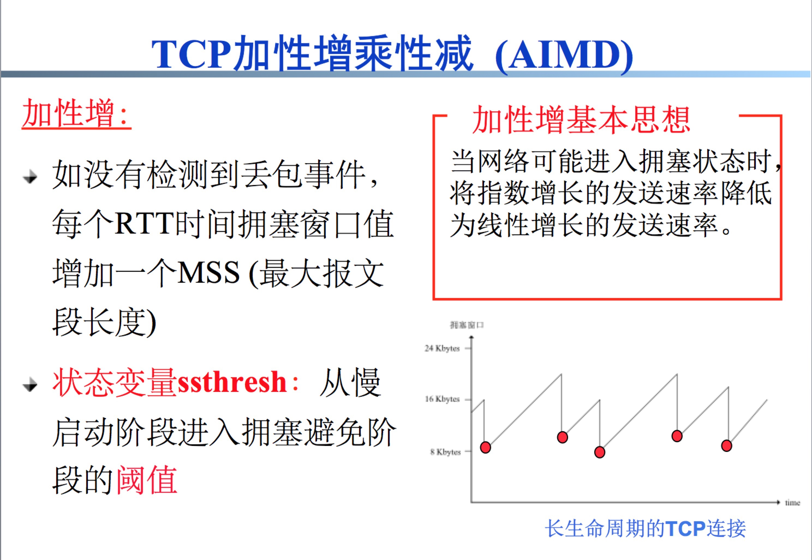

### **关于TCP/IP/ARP的一些理解**

------

#### **TCP协议**

- tcp头结构定义：

  

  > 
  >
  > - 头部源码：
  >
  > /*TCP头定义，共20个字节*/
  >
  > typedef struct _TCP_HEADER
  >
  > {
  >
  > short m_sSourPort; 　　　　　　// 源端口号16bit
  >
  > short m_sDestPort; 　　　　　　 // 目的端口号16bit
  >
  > unsigned int m_uiSequNum; 　　// 序列号32bit
  >
  > unsigned int m_uiAcknowledgeNum; // 确认号32bit
  >
  > short m_sHeaderLenAndFlag; 　　// 前4位：TCP头长度；中6位：保留；后6位：标志位
  >
  > short m_sWindowSize; 　　　　　// 窗口大小16bit
  >
  > short m_sCheckSum; 　　　　　 // 检验和16bit
  >
  > short m_surgentPointer; 　　　　 // 紧急数据偏移量16bit
  >
  > }**attribute**((packed))TCP_HEADER, *PTCP_HEADER;
  >
  > 
  >
  > > - m_sWindowSize:指明了接收窗口的的大小，决定了该次发送数据的量；
  > >
  > > 

- m_uiAcknowledgeNum,收到冗余ACK的原因，有包丢失，因为TCP是累计确认的。

- 拥塞控制：

  

  

  

#### IP与ARP的一些思考**

- IP是变动地址，MAC是固定地址。ip数据报使用的地址是ip，物理层“帧”使用的地址是MAC地址。多路由路径时：帧只关心下一路由的物理地址并传送过去，而IP发挥的作用是路由转发。
- 将动态地址与固定地址分离。