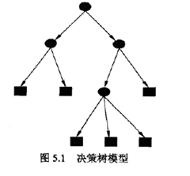
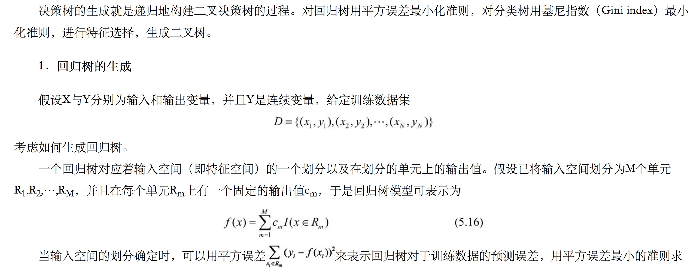
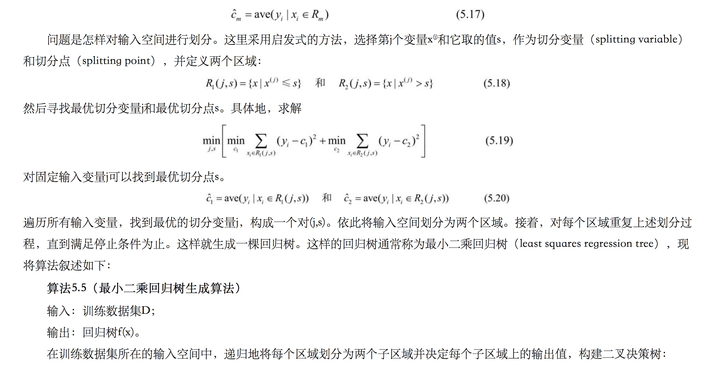

### 决策树

***

#### 定义

**决策树是表示基于特征对实例进行分类的树形结构**

​      从给定的训练数据集中，依据特征选择的准则，递归的选择最优划分特征，并根据此特征将训练数据进行分割，使得各子数据集有一个最好的分类的过程。 

决策树算法3要素： 

- 特征选择
- 决策树生成
- 决策树剪枝

**特征选择决定了使用哪些特征来划分特征空间。最优的特征选择是在每次划分之后，分支节点所包含的样本都尽可能属于同一个分类。这样的决策树高度低，决策路径短，决策效率高**

#### 决策树与条件概率分布等价

决策树还表示给定特征条件下类的条件概率分布。这一条件概率分布定义在特征空间的一个划分(partition)上，将特征空间划分为互不相交的单元(cell)或区域(region)，并在每个单元定义一个类的概率分布就构成了一个条件概率分布。

决策树构建过程中要使得决策树的复杂度最小

$T_{cost} =argmin\{\sum_t^{N(t)} P(t|x_1...x_t) *Deep(t)\}$  

$N(t)​$表示决策树所有叶节点，$P(t|x_1...x_t) ​$表示分类为t的条件概率，$Deep(t)​$表示搜索到叶节点t的深度。

优秀的决策树$T_{cost}$应该是最小的。

### ID3算法(信息增益)

***

**信息熵**

熵：度量随机变量的不确定性。（纯度）

定义：假设随机变量X的可能取值有x1，x2， ... , xn 对于每一个可能的取值xi，其概率

> $P(X=x_i) = p_i  , ( i = 1,2, ... , n) $

因此随机变量X的熵：

> $H(X)=-\sum_{i=1}^np_ilog_{2}p_i$

**信息增益**

划分前样本集合D的熵是一定的 ，entroy(前)， 使用某个特征A划分数据集D，计算划分后的数据子集的熵 entroy(后) 

​                                   **信息增益 =**  **entroy(前) -**  **entroy(后)** 

信息增益的数学公式：

$IG(D,A)=H(D)-H(D|A)$

$IG(D,a)=Entropy(D)-\sum\limits_{values(a)}\cfrac{|S_a(v)|}{S} Entropy(S_a(v))$

$vale({a})$表示特征a的值集合，$S_a(v)$表示值a划分的子集合。

$H_a(D)= - \sum\limits_{values(a)}\cfrac{|S_a(v)|}{|D|}log_2\cfrac{|S_a(v)|}{|D|}$     （a是类别时表示集合的信息熵，a是特征时，表示的是集合中特征a的信息熵）

信息增益值的大小是相对与训练数据集而言的，并没有绝对的意义，在分类问题困难时，即训练数据集的经验熵大的时候，信息增益值会偏大。因此信息增益比较 偏向取值较多的特征。

### ID4.5（信息增益率)

***

**信息增益率**

$IG_r=\cfrac{IG(D,a)}{H_a(D)}$

**信息增益比本质： 是在信息增益的基础之上乘上一个惩罚参数。特征个数较多时，惩罚参数较小；特征个数较少时，惩罚参数较大。**

 **惩罚参数**：数据集D以特征A作为随机变量的熵的倒数，即：将特征A取值相同的样本划分到同一个子集中（之前所说数据集的熵是依据类别进行划分的）**

当特征取值较少时HA(D)的值较小，因此其倒数较大，因而信息增益比较大。因而偏向取值较少的特征。 

 **使用信息增益比****：基于以上缺点，并不是直接选择信息增益率最大的特征，而是现在候选特征中找出信息增益高于平均水平的特征，然后在这些特征中再选择信息增益率最高的特征。**    

### CART算法(分类与回归树)

***

CART是在给定的输入随机变量X条件下输出变量Y的条件概率分布的学习方法。

**基尼指数**

分类问题中，假设有K个类，样本点属于第k个类的概率为$p_k$，则概率分布的基尼指数定义为

> $Gini(p)=\sum\limits_{k=1}\limits^Kp_k(1-p_k) = 1-\sum\limits_{k=1}\limits^Kp_k^2​$

则在特征A的条件下，集合D的基尼指数定义为

> $Gini(D,A) =\sum\limits_{a\in{values(A)}}\limits^{values(A)}\cfrac{|D_a|}{|D|}Gini(D_a)$

**决策树**(下期在完善)

用基尼指数训练决策树时，**选择基尼指数最小的特征作为切分特征!!!**

**回归树**

